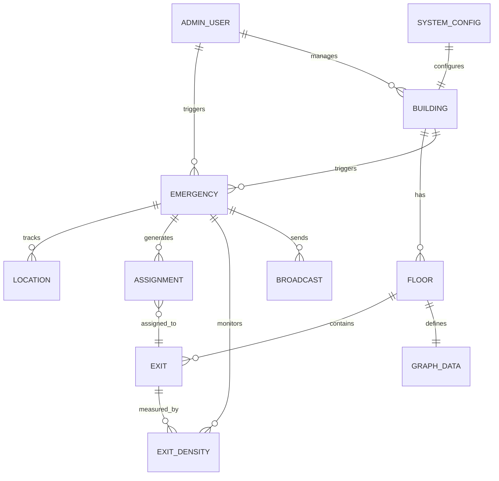

# Database Schema — NETRA

## Firebase Firestore + Realtime Database

---

## 1. Firestore Collections (Persistent Data)

### buildings
```
Collection: buildings/{buildingId}
{
  buildingId: string (auto-generated),
  name: string,
  address: string,
  city: string,
  country: string,
  type: "MALL" | "OFFICE" | "HOTEL" | "AIRPORT" | "HOSPITAL" | "UNIVERSITY" 
        | "STADIUM" | "METRO" | "PARK" | "OTHER",
  totalCapacity: number,
  floorCount: number,
  geoLocation: {
    lat: number,
    lng: number
  },
  geofenceRadius: number (meters),
  createdBy: string (admin userId),
  createdAt: Timestamp,
  updatedAt: Timestamp,
  isActive: boolean
}

Sub-collection: buildings/{buildingId}/floors/{floorId}
{
  floorId: string,
  floorNumber: number,
  name: string ("Ground Floor", "Level 1", etc.),
  planImageUrl: string (Cloud Storage URL),
  planWidth: number (meters),
  planHeight: number (meters),
  graphData: {
    nodes: [
      {
        id: string,
        x: number (relative to plan),
        y: number (relative to plan),
        type: "WAYPOINT" | "EXIT" | "STAIRWELL" | "ELEVATOR" | "ENTRANCE",
        accessible: boolean,
        metadata: {}
      }
    ],
    edges: [
      {
        id: string,
        from: string (nodeId),
        to: string (nodeId),
        distance: number (meters),
        width: number (meters),
        accessible: boolean,
        bidirectional: boolean,
        capacity: number (people per minute)
      }
    ]
  },
  createdAt: Timestamp,
  updatedAt: Timestamp
}

Sub-collection: buildings/{buildingId}/exits/{exitId}
{
  exitId: string,
  name: string ("Exit A", "North Door", etc.),
  floorId: string,
  graphNodeId: string (reference to node in graphData),
  location: {
    x: number,
    y: number
  },
  geoLocation: {
    lat: number,
    lng: number
  },
  capacity: number (max people per minute),
  type: "DOOR" | "STAIRWELL" | "ELEVATOR" | "GATE",
  accessible: boolean,
  isEmergencyExit: boolean,
  status: "ACTIVE" | "BLOCKED" | "MAINTENANCE",
  createdAt: Timestamp,
  updatedAt: Timestamp
}
```

### emergencies_log
```
Collection: emergencies_log/{emergencyId}
{
  emergencyId: string,
  buildingId: string,
  type: "FIRE" | "TERRORIST_ATTACK" | "EXPLOSION" | "STAMPEDE" 
       | "NATURAL_DISASTER" | "INFRASTRUCTURE_FAILURE" | "OTHER",
  severity: "LOW" | "MEDIUM" | "HIGH" | "CRITICAL",
  status: "ACTIVE" | "RESOLVED" | "CANCELLED",
  triggeredBy: string (admin userId),
  triggeredAt: Timestamp,
  resolvedBy: string (admin userId, optional),
  resolvedAt: Timestamp (optional),
  affectedFloors: [string],
  hazardZones: [
    {
      id: string,
      floorId: string,
      polygon: [{x, y}],
      type: "FIRE" | "STRUCTURAL" | "CHEMICAL" | "OTHER",
      createdAt: Timestamp
    }
  ],
  blockedExits: [string (exitId)],
  totalDetectedUsers: number,
  totalEvacuated: number,
  avgEvacuationTimeSeconds: number,
  exitUtilization: {
    [exitId]: {
      assigned: number,
      evacuated: number,
      peakDensity: number
    }
  },
  communicationStats: {
    pushSent: number,
    pushDelivered: number,
    smsSent: number,
    smsDelivered: number,
    ivrCalls: number,
    ivrCompleted: number
  },
  timeline: [
    {
      timestamp: Timestamp,
      event: string,
      details: string,
      actor: string
    }
  ],
  createdAt: Timestamp,
  updatedAt: Timestamp
}
```

### admin_users
```
Collection: admin_users/{userId}
{
  userId: string (Firebase Auth UID),
  email: string,
  displayName: string,
  role: "SUPER_ADMIN" | "ADMIN" | "OPERATOR" | "VIEWER",
  assignedBuildings: [string (buildingId)],
  mfaEnabled: boolean,
  lastLogin: Timestamp,
  createdAt: Timestamp,
  updatedAt: Timestamp,
  isActive: boolean
}
```

### system_config
```
Collection: system_config/{configId}
{
  configId: string,
  buildingId: string (or "GLOBAL"),
  densityThresholds: {
    low: number (0-1),
    medium: number (0-1),
    high: number (0-1),
    critical: number (0-1)
  },
  rebalancingConfig: {
    triggerThreshold: number (0-1),
    recheckIntervalMs: number,
    maxReroutesPerUser: number,
    minDistanceToSkipReroute: number (meters),
    improvementThreshold: number (0-1)
  },
  notificationConfig: {
    pushEnabled: boolean,
    smsEnabled: boolean,
    ivrEnabled: boolean,
    smsGateway: string,
    ivrProvider: string
  },
  voiceConfig: {
    language: string ("en-US"),
    speed: number (0.5-2.0),
    voice: string
  },
  accessibilityConfig: {
    prioritizeAccessibleExits: boolean,
    speedReductionFactor: number (0-1),
    autoAlertAuthorities: boolean
  },
  dataRetention: {
    locationDataTTLHours: number,
    emergencyLogRetentionDays: number
  },
  updatedAt: Timestamp,
  updatedBy: string
}
```

---

## 2. Realtime Database Structure (Hot Path)

```
/active_emergencies/{emergencyId}/
  status: "ACTIVE"
  buildingId: string
  type: string
  severity: string
  triggeredAt: number (Unix ms)
  hazardZones: {...}
  blockedExits: [...]

/locations/{emergencyId}/{anonymousUserId}/
  lat: number
  lng: number
  floor: number
  accuracy: number
  deviceType: "SMARTPHONE_ONLINE" | "SMARTPHONE_WEAK" | "FEATURE_PHONE" 
             | "WEARABLE" | "UNKNOWN"
  accessibilityNeeds: "NONE" | "WHEELCHAIR" | "VISUAL" | "HEARING" | "MOBILITY"
  timestamp: number (Unix ms)
  isEvacuated: boolean

/assignments/{emergencyId}/{anonymousUserId}/
  exitId: string
  exitName: string
  route: [
    { x: number, y: number, floor: number }
  ]
  estimatedTimeSeconds: number
  distanceMeters: number
  version: number (increments on reroute)
  assignedAt: number (Unix ms)
  updatedAt: number (Unix ms)

/exit_density/{emergencyId}/{exitId}/
  currentDensity: number (0-1)
  assignedCount: number
  evacuatedCount: number
  capacity: number
  queueEstimate: number
  status: "OPEN" | "CONGESTED" | "BLOCKED"
  updatedAt: number (Unix ms)

/broadcasts/{emergencyId}/{broadcastId}/
  message: string
  channels: ["PUSH", "SMS", "IVR"]
  sentBy: string
  sentAt: number (Unix ms)
  deliveryCount: number

/evacuation_progress/{emergencyId}/
  totalUsers: number
  evacuatedUsers: number
  percentComplete: number
  estimatedCompletionTime: number (Unix ms)
  updatedAt: number (Unix ms)
```

---

## 3. Data Relationships



---

## 4. Indexing Strategy

### Firestore Composite Indexes
```
buildings: (city ASC, type ASC, isActive ASC)
emergencies_log: (buildingId ASC, status ASC, triggeredAt DESC)
emergencies_log: (status ASC, triggeredAt DESC)
admin_users: (role ASC, isActive ASC)
```

### Realtime Database Rules
```json
{
  "rules": {
    "active_emergencies": {
      ".read": true,
      ".write": "auth != null && root.child('admin_users').child(auth.uid).child('role').val() !== 'VIEWER'"
    },
    "locations": {
      "$emergencyId": {
        "$userId": {
          ".read": true,
          ".write": true
        }
      }
    },
    "assignments": {
      "$emergencyId": {
        ".read": true,
        "$userId": {
          ".write": "auth != null"
        }
      }
    },
    "exit_density": {
      ".read": true,
      ".write": "auth != null"
    },
    "evacuation_progress": {
      ".read": true,
      ".write": "auth != null"
    }
  }
}
```

---

## 5. Data Lifecycle

| Data Type | Creation | TTL | Archival |
|---|---|---|---|
| Building config | Admin setup | Permanent | N/A |
| Floor plans | Admin upload | Permanent | Version history |
| User locations | Emergency event | 24 hours post-event | Deleted |
| Route assignments | Emergency event | 24 hours post-event | Deleted |
| Exit density | Emergency event | 24 hours post-event | Aggregated stats kept |
| Emergency logs | Emergency trigger | 365 days | Cold storage archive |
| Audit logs | Any admin action | 730 days | Cold storage archive |
| Broadcasts | During emergency | 90 days | Summarized in emergency log |

> **Current state**: The dashboard uses React `useState` to hold all scenario data in memory, simulating the RTDB hot-path during demo mode. No live Firebase connection is active in the current build. The schema above defines the production target.
